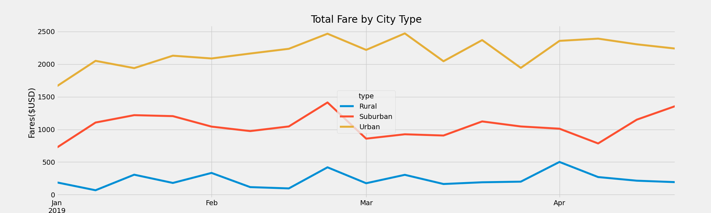

# PyBer_Analysis
## Overview of the analysis 
### Purpose
This project is to create visualizations of rideshare data for PyBer to help improve access to ride-sharing services and determine affordability for underserved neighborhoods. Python graphing library Matplotlib is used in this project. In the first part of this analysis, we read the city and ride data file and then merge the data into a single dataset. Then, we got the following information for each city type: total rides, total drivers, total amount of fares, the average fare per ride, and the average fare per driver. After cleaning up the dataset and formatting the columns, a PyBer summary DataFrame is created. In the second part of this analysis, we used groupby, pivot and resample functions to create a new Dataframe and get the sum of the fares for each week. In the end, the df.plot function and object-oriented interface method is used to create a multiple line plot that shows the total weekly of the fares for each type of city.           
## Results
The following summary dataframe was created and then analyzed. We noted through seeing this visualization image that Urban type of city has the largest number of total rides compared to Rural and Suburban types and Rural cities have the least. We also noted that Urban cities have the most revenue due to the total rides. However, we noted that the average fare per ride in Urban cities is the smallest and Rural cities have the highest average fare per ride. In addition, the average fare per driver column indicates that drivers in Rural cities make the largest amount ($55.49), while drivers in Urban cities make the least amount ($16.57). 

Next, a multiple line chart was created and then analyzed. From this visualization, we can see the trend of total fares from January 1, 2019, to April 29, 2019 for the three city types: Rural, Suburban and Urban. We noted that Urban Cities have the highest total fares and Rural cities have the least total fares for entire analyzed periods/weeks. We also noted that the 3rd week of February indicates an increase demand of rides for each of the city type. Urban Cities have a more consistent trend of increasing and decreasing in March. In the 3rd week of April, Suburban cities show an increased demand.  

## Summary

Based on the results, there are three business recommendations to the CEO:

1. It is recommended that more investments shall be made in the Urban cities. 
2. If we can have more drivers come to Rural cities, more revenue can be generated in this area due the their highest average fare per driver. 
3. Since Suburban cities's performance results/metrics is in between those in Urban and Rural cities, more investments can be continued made in Urban and Rural cities. 

